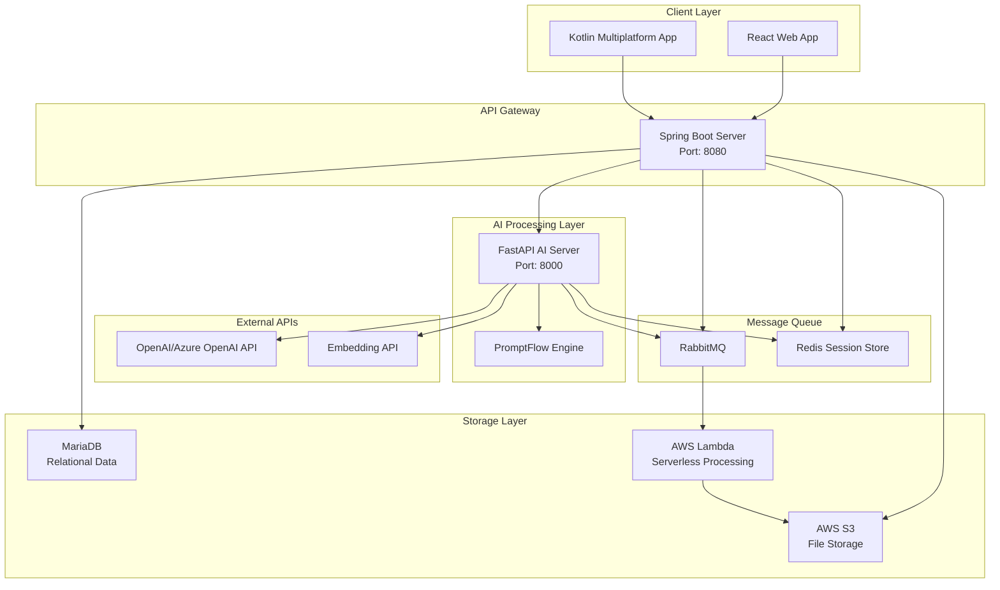
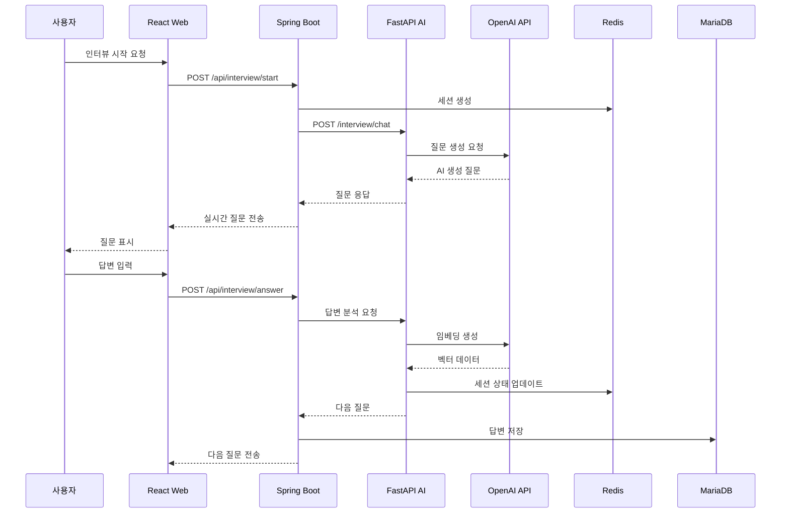

# 4.2.3 Interface-Related Requirement (인터페이스 관련 요구사항)

## 시스템 아키텍처 구조도

## 1) System Interface Requirements (시스템 인터페이스 요구사항)

### 실시간 사용자 상호작용
◆ 시스템은 실시간 사용자 입력 및 질문 제시를 지원해야 한다.
- React 기반 웹 인터페이스에서 실시간 채팅 형태의 인터뷰 진행
- WebSocket 또는 Server-Sent Events를 통한 실시간 통신 지원
- 사용자 응답에 따른 동적 질문 생성 및 표시

### 세션 연속성 관리
◆ 시스템은 세션 연속성을 유지해야 하며, 주제 히스토리 및 진행 상황 추적을 포함해야 한다.
- Redis를 통한 세션 상태 관리 및 인터뷰 진행 상황 저장
- 사용자별 인터뷰 히스토리 및 자서전 작성 진행도 추적
- 중단된 세션의 복구 및 이어서 진행 기능

### 다중 플랫폼 지원
◆ 시스템은 다중 플랫폼 접근을 지원해야 한다.
- 웹 브라우저를 통한 접근 (React 웹 애플리케이션)
- 모바일 애플리케이션을 통한 접근 (Kotlin Multiplatform)
- 반응형 디자인을 통한 다양한 화면 크기 지원

## 2) Software/API Interface Requirements (소프트웨어/API 인터페이스 요구사항)

### AI 서비스 연동
◆ 시스템은 임베딩 API와 연동하여 의미적 벡터 생성을 수행해야 한다.
- Azure OpenAI 또는 OpenAI API를 통한 텍스트 임베딩 생성
- 사용자 응답의 의미적 분석을 위한 벡터 변환
- 유사한 주제 및 내용 매칭을 위한 벡터 유사도 계산

### NLP 처리 엔진
◆ NLP 전처리 및 벡터 연산은 Python 기반 라이브러리를 통해 처리되어야 한다.
- FastAPI 기반 AI 서버에서 자연어 처리 수행
- PromptFlow를 활용한 대화형 AI 플로우 관리
- Spring Boot 서버와 AI 서버 간 RESTful API 통신

### 클라우드 서비스 연동
◆ 시스템은 외부 클라우드 서비스와의 안정적인 연동을 보장해야 한다.
- AWS S3를 통한 파일 저장 및 관리
- AWS Lambda를 통한 서버리스 처리
- RabbitMQ를 통한 비동기 메시지 처리
- MariaDB를 통한 관계형 데이터 저장

## 3) User-Facing Interface Requirements (사용자 대면 인터페이스 요구사항)

### 인터뷰 인터페이스 구성
◆ 인터페이스는 질문 표시 영역과 텍스트 입력 필드를 포함해야 한다.
- 명확하게 구분된 질문 표시 영역 (상단)
- 사용자 응답을 위한 텍스트 입력 필드 (하단)
- 채팅 형태의 대화 히스토리 표시
- 질문과 답변의 시각적 구분을 위한 UI 디자인

### 질문 스킵 기능
◆ 사용자에게는 선택 가능한 스킵 사유와 함께 스킵 옵션이 제공되어야 한다.
- "나중에 답변하기" 옵션
- "개인적인 내용이라 답변하기 어려움" 옵션
- "질문을 이해하지 못함" 옵션
- "기타 사유" 옵션 (자유 텍스트 입력)
- 스킵된 질문의 재방문 기능

### 진행 상황 표시
◆ 인터페이스는 인터뷰 진행 상황과 세션 상태를 표시해야 한다.
- 전체 인터뷰 진행률 표시 (진행바 또는 백분율)
- 현재 주제/카테고리 표시
- 답변 완료된 질문 수 / 전체 질문 수
- 세션 지속 시간 표시
- 저장 상태 표시 (자동 저장 완료/진행 중)

## 4) Output Interface Requirements (출력 인터페이스 요구사항)

### 원고 미리보기 기능
◆ 완성된 원고는 미리보기가 가능해야 하며, 일반 텍스트 또는 PDF 형식으로 다운로드할 수 있어야 한다.
- 실시간 원고 미리보기 기능
- 챕터별/주제별 구성 미리보기
- 편집 가능한 텍스트 형태의 미리보기
- 최종 완성본 확인을 위한 전체 미리보기

### 다운로드 형식 지원
◆ 다양한 형식의 파일 다운로드를 지원해야 한다.
- **일반 텍스트 (.txt)**: 순수 텍스트 형태의 원고
- **PDF (.pdf)**: 서식이 적용된 완성된 자서전 형태
- **워드 문서 (.docx)**: 편집 가능한 문서 형태 (선택사항)
- 다운로드 전 파일명 사용자 지정 기능

### 출력 품질 관리
◆ 출력되는 원고의 품질과 형식을 보장해야 한다.
- 일관된 문체와 톤 유지
- 적절한 문단 구분과 챕터 구성
- 날짜, 장소, 인물명 등의 정확성 검증
- 개인정보 보호를 위한 민감 정보 마스킹 옵션

## 인터페이스 통신 플로우

## 기술 스택별 인터페이스 명세

### Frontend (React)
- **통신 방식**: RESTful API, WebSocket
- **데이터 형식**: JSON
- **상태 관리**: Zustand
- **HTTP 클라이언트**: React Query

### Backend (Spring Boot)
- **API 스타일**: RESTful API
- **인증**: OAuth2 + JWT
- **데이터베이스**: JPA/Hibernate
- **캐싱**: Redis

### AI Server (FastAPI)
- **API 스타일**: RESTful API
- **AI 프레임워크**: PromptFlow
- **벡터 처리**: NumPy, scikit-learn
- **비동기 처리**: asyncio

### Mobile App (Kotlin Multiplatform)
- **통신 방식**: RESTful API
- **HTTP 클라이언트**: Ktor
- **상태 관리**: Compose State
- **플랫폼**: Android, iOS
